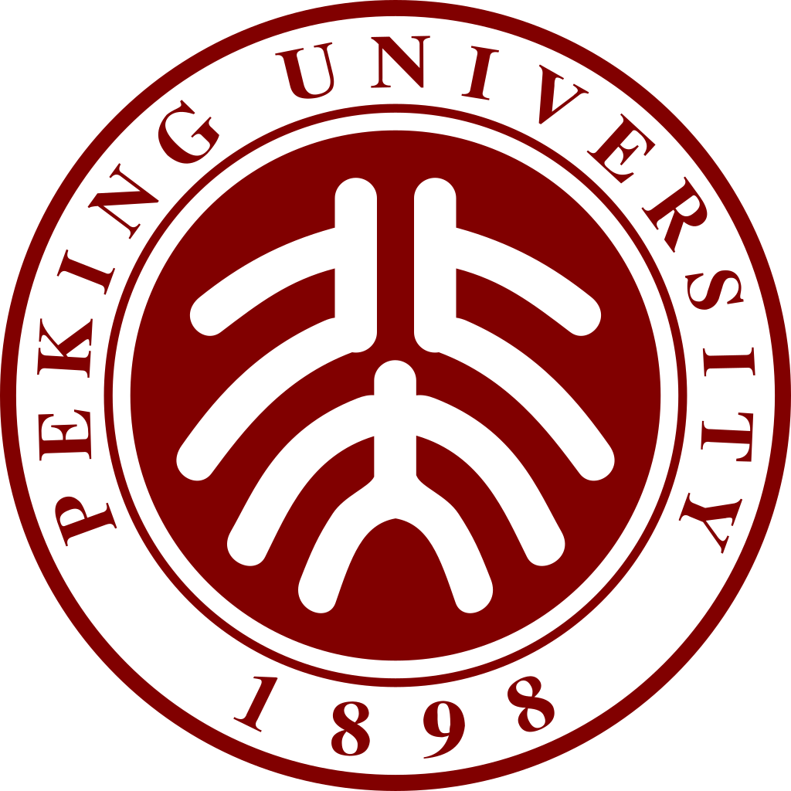
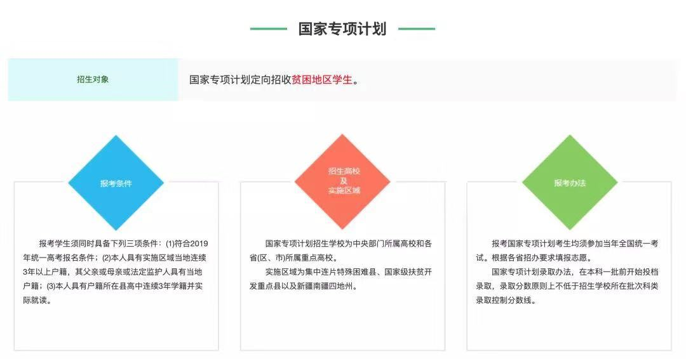

在多少人眼里，北大曾经是中国最顶尖的学府，崇高的象牙塔，多少人魂牵梦绕都想去求学的地方。

北大的校徽由鲁迅先生所设计，校徽为一中国传统瓦当形象，为上下排列的篆字“北大”。既寓意“以人为本”“进步向上”，又有“三人成众”之意，还可以看成是人的脊梁骨，借此勉励北大学生争做国家民主进步的脊梁。

但就这么一所顶尖学府，近期因为某考生退档事情被迅速送上热搜，又很快从热搜撤下，且热度永远不超过400w。
一所二流学校都能能力下热搜，北大当然不在话下，只是一流的大学，末流的胸怀，一流的公关。

这个事件也比较简单，首先来说明一下什么是国家专项计划。

国家专项计划是指中国人民共和国教育部规定主要招收边远，贫困，民族等地区县（含县级市）以下高中勤奋好学，成绩优良的农村学生，简而言之就是农村单独招生。

北大今年在河南有8名国家专项计划，这名考生刚好位于该专项计划的第八名，服从专业调剂，投档北大，随后被北大提档。在此提一句，专项计划中的考生在投档前是看不到自己的排名的，也就是说他有很大把握能进北大。

然而，北大在过了第一批投档线后，7月10号开始反悔，给该考生进行退档。一个顶尖学府，为了一个贫困地区的名额，可以说是吃相非常难看了，北大之大，竟无一国专生的容身之处。

同时国家专项有提到是只要过了一本线，高校不能拒绝录取该考生。而这名考生已过了一本线38分，被北大嫌弃成绩太差，予以拒绝。[高考成绩过低，根据我校教学强度，若录取该生，考生入校后**极有可能**因完不成学业被退学。本着以人为本，**为考生负责**的态度，特向贵办申请退档。]

翻译过来就是北大对他说：小伙子，你不配！

河南省考试院拒绝了北大的请求，反复推了2次，并被北大连续3次以同样的理由拒绝。

北大用它超然的地位，在短短的十几分钟内拒绝了一个少年的梦想，而且它也预料到了参与国家专项计划的贫困生是不可能反抗的，欺的就是少年穷。

------------------------------------------------------------
后续更新

这件事在2019/8/8经过发酵，于8/12日，北大迫于舆论压力决定补录河南两位过档考生，真的是戏剧性。

但北大也不再是我们心中那和它大门一样大气磅礴的样子，为了一个名额尽出洋相。

北大还是那个北大，但北大已经不再是北大。
